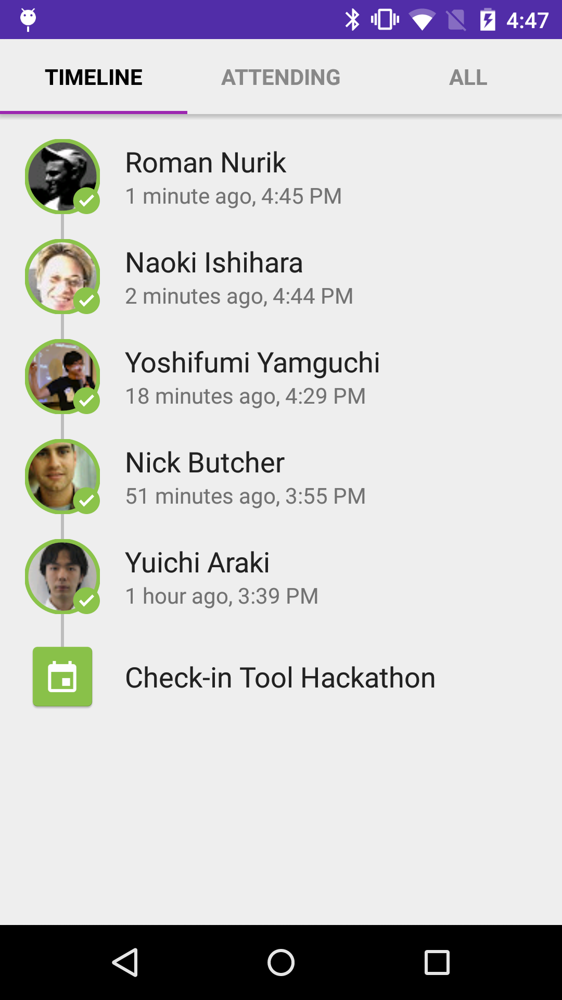
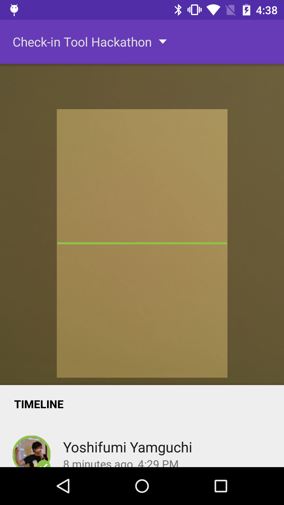
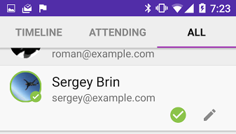
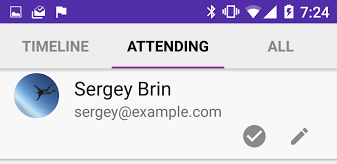

Gutenberg
=========

# Overview

Project Gutenberg is a reference application whose source code shows how to use
the Material Design Library to bring Material Design to the Attendee Check-in
Tool. This tool makes it easy for onsite receptionists to check in event
attendees by scanning their QR codes. Gutenberg consists of a client-side
(Android) and server-side application (Google App Engine).

This document describes how to use Gutenberg.




## Building

### Cloning

```shell
$ git clone git@github.com:googlesamples/event-checkin.git
```

### Prerequisites

- Android SDK v22
- Android Build Tools v22.0.1
- Android 5.1 (API 22) SDK Platform
- Android Support Repository

### Building

```shell
$ ./gradlew assembleDebug
```

### Importing into Android Studio

1. Clone the repository.
2. Open Android Studio.
3. Under the "Quick Start" section of Android Studio, select
   *Import project (Eclipse ADT, Gradle, etc.)*.
4. Select the project directory.

# API specification

Gutenberg client is interacting with the server based on the following API
specification.

## Data model

```go
type Attendee struct {
	Code        string `json: "code"`
	Email       string `json: "email"`
	Name        string `json: "name"`
	PlusID      string `json: "plusid"`
	CheckinTime int64  `json: "checkinTime"` // Unix time
}

type Event struct {
	ID            int64  `json: "id"`
	Name          string `json: "name"`
	StartTime     int64  `json: "startTime"`     // Unix time // No need yet
	EndTime       int64  `json: "endTime"`       // Unix time // No need yet
	OrganizerName string `json: "organizerName"` // No need yet
}
```

## Interface

### Event list
    GET /v1/event/list

### Attendees list
    GET /v1/event/{Event.ID}/attendees

### Update attendees’ checkin
    POST /v1/event/{Event.ID}/{Attendee.ID}/checkin

# Simple server application

We plan to provide a simple server application to store event data in the
future. The simple server application will have a demo feature.

# Target audience

* Hosted by:
  - Google Dev Platform team
  - GDGs
  - GDEs
* Number of attendees: 10 to 1,000
* Number of client-application instances used simultaneously: 5
* Supported client-side device: Nexus 5 or equivalent Android phone

# Non-target-audience

* Hosted by: Non-Google-related events
* Number of of attendees: 1,000+
* Devices: All tablets and non-Android phones

# Pre-event

Gutenberg has no event-registration system. Instead, it imports data to, or
exports it from, an existing event-registration system.

## Meetup.com
To use Gutenberg with Meetup.com, an event organizer needs to take the following
steps:
* Add mandatory fields for for email address and Google+ ID.
* Send participants their QR codes via e-mail (link to MailMerge).

We plan to support the Meetup.com API in a future version of Gutenberg, to allow
event organizers to easily import attendee data into Meetup.com.

## Creating an event on the server

Create an event by importing a CSV file into the Gutenberg application running
on the server side.

# Set up the Gutenberg application

Build the Gutenberg client-side application.
(See the steps of "Building" section above.)
* Install Gutenberg.
* Start the application.
* Select the same account as the one you’re using for the server application.
* Select the event for which to register attendees.
* If all attendee names appear under the *ALL*  tab, setup has succeeded.

# Time of event

During the event, the event organizer needs to take the following steps:
Keep connecting the Android phone installed Gutenberg to the charger since
running Gutenberg consume a lot of power.
Once attendees come to the event, check them in by scanning the QR code they
bring. The check-in time is stored both in the server and client if it is valid.

Once an attendee is checked-in successfully, a green “check” mark will be on
his avatar.



Also the event organizer might take the following actions if needed:

* See the error code if the QR code is not valid or the code has been used
  already.
* Draw up the timeline to see who checked-in already.
* See “Attending” tab to see who are expected to come.
* See “All” tab to see the whole list of attendees of the event.
* Check-in attendee manually simply pressing “check” mark.



* Revert the check-in by pressing “check” mark in “All” tab if he/she was
  checked-in by  mistake.
* Leave a memo by pressing pencil mark.

Search feature is not implemented yet.
